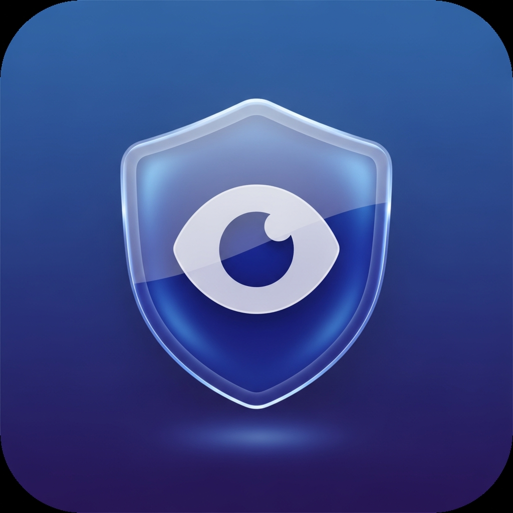

<div align="center">



<h1>Null Trace</h1>

<p><strong>A production-grade, multi-profile privacy browser for Android & iOS</strong><br/>Built with Expo SDK 54 · React Native 0.81 · TypeScript · EAS</p>

[](https://github.com/kakarot-oncloud/null-trace/actions/workflows/eas-build.yml)
[](https://www.typescriptlang.org)
[](https://expo.dev)
[](https://reactnative.dev)
[](https://reactnative.dev/docs/the-new-architecture/landing-page)
[](LICENSE)
[](https://expo.dev)

<!-- LATEST_BUILD -->
[](https://github.com/kakarot-oncloud/null-trace/releases/latest)

[Features](#-features) · [Architecture](#-architecture) · [Installation](#-installation) · [Build & CI](#-build--cicd) · [Changelog](#-changelog) · [Contributing](#-contributing)

</div>

---

## What is Null Trace?

Null Trace is not a WebView wrapper with a privacy label slapped on it. It is a **fully isolated, multi-profile privacy browser** built from scratch with a layered privacy engine — every request, script, cookie, and identity is controlled per profile.

Think Brave + Firefox Focus + Tor Browser, built natively for Android and iOS with Expo.

> **Transparency:** Null Trace runs on the system WebView (Android Chromium / iOS WKWebView). It cannot modify TLS fingerprints or route all OS traffic without a VPN — an inherent limitation shared by every WebView-based browser.

---

## ✨ Features

### Browser Core

| Capability | Detail |
|---|---|
| Full WebView browsing | Address bar, progress bar, HTTPS indicator |
| Tab management | Open · close · switch — card grid UI |
| Hardware back button | Navigates WebView history on Android; exits only when no history remains |
| Pull-to-refresh | Native gesture support |
| Swipe navigation | Back/forward via swipe gesture |
| Share & copy URL | Native share sheet + clipboard |
| Download manager | In-app downloads with progress, share-on-complete |

### Privacy Engine

| Layer | Feature | Description |
|---|---|---|
| **Request** | Ad Blocker | Blocks 25+ ad networks before they load |
| **Request** | Tracker Blocking | Eliminates analytics, heatmaps, data brokers |
| **Request** | HTTPS-First | Auto-upgrades HTTP → HTTPS |
| **JavaScript** | WebRTC Shield | Disables `RTCPeerConnection` to prevent IP leaks |
| **JavaScript** | Do Not Track | Injects `DNT: 1` + `navigator.doNotTrack = '1'` |
| **JavaScript** | Language Spoof | Per-profile `navigator.language` override |
| **HTTP** | Referrer Policy | None / Same-origin / Default — configurable |
| **Cookie** | Third-party blocking | Block all third-party cookies |
| **Cookie** | Clear on Exit | Auto-wipe cookies, cache, and history on close |
| **Storage** | Profile Isolation | Separate AsyncStorage namespace per profile |
| **Secure** | PIN Storage | Device keychain via `expo-secure-store` |

### Multi-Profile System

- Unlimited isolated browser profiles
- Each profile owns its own: tabs · bookmarks · history · settings · cookies · proxy · identity
- Per-profile user-agent spoofing (Chrome / Firefox / Safari / mobile variants)
- Per-profile language & locale override
- Profile color indicators throughout the UI

### Proxy Manager

- Supports **HTTP**, **HTTPS**, and **SOCKS5** proxies
- Formats: `IP:PORT` and `USER:PASS@IP:PORT`
- Live connection test: shows exit IP, country flag, and latency
- Proxies are assigned per-profile — profiles never share tunnels

### App Lock

- Configurable **4–8 digit PIN** with shake animation on wrong entry
- **Face ID / Fingerprint** biometric unlock via `expo-local-authentication`
- PIN stored in device secure enclave — never in AsyncStorage
- Auto-locks when app goes to background

---

## 🏗️ Architecture

```
┌──────────────────────────────────────────────────────┐
│                    Null Trace App                    │
│                                                      │
│  ┌────────────┐  ┌────────────┐  ┌────────────────┐ │
│  │  App Lock  │  │  Profiles  │  │ Browser Engine │ │
│  │ PIN/Biom.  │  │  isolated  │  │ WebView + priv │ │
│  └────────────┘  └────────────┘  └────────────────┘ │
│                                                      │
│  Privacy Pipeline (applied per request):             │
│  ┌──────────────────────────────────────────────┐   │
│  │  Request → JS Inject → Cookie → Storage      │   │
│  │  (block)   (spoof)    (filter)  (isolate)    │   │
│  └──────────────────────────────────────────────┘   │
│                                                      │
│  Storage Layers:                                     │
│  ┌─────────────────────┐  ┌───────────────────────┐ │
│  │    AsyncStorage     │  │   expo-secure-store   │ │
│  │  tabs/bookmarks/    │  │  PIN — device secure  │ │
│  │  history/settings   │  │       enclave         │ │
│  └─────────────────────┘  └───────────────────────┘ │
└──────────────────────────────────────────────────────┘
```

### Privacy Stack (layered, applied in order)

```
1. Request Layer     Block ad/tracker domains before any network call
2. HTTPS Layer       Upgrade HTTP → HTTPS automatically
3. JavaScript Layer  Inject privacy overrides before page scripts run
4. Cookie Layer      Block/clear third-party cookies per policy
5. Profile Layer     Namespace all storage under profile ID
6. Secure Layer      Encrypt PIN in device keychain
```

---

## 📁 Project Structure

```
null-trace/                              ← pnpm monorepo root
├── artifacts/
│   └── privacy-browser/                 ← Expo app (@workspace/privacy-browser)
│       ├── app/
│       │   ├── index.tsx                ← Main browser (back handler, WebView)
│       │   ├── _layout.tsx              ← Root layout, providers, fonts
│       │   ├── settings/                ← Privacy & browser settings
│       │   ├── profiles/                ← Profile list + editor
│       │   ├── bookmarks/               ← Bookmarks & history
│       │   ├── proxy/                   ← Proxy manager + connection tester
│       │   └── downloads/               ← Download manager
│       ├── components/
│       │   ├── AddressBar.tsx           ← Safari-style URL bar
│       │   ├── BrowserWebView.tsx       ← WebView + privacy injection
│       │   ├── BrowserToolbar.tsx       ← Bottom tab bar
│       │   ├── HomeScreen.tsx           ← New-tab page
│       │   ├── TabSwitcher.tsx          ← Card-grid tab manager
│       │   ├── MenuSheet.tsx            ← Bottom sheet menu
│       │   ├── PinLock.tsx              ← PIN entry + biometric prompt
│       │   └── SettingsRow.tsx          ← Reusable settings toggle row
│       ├── context/
│       │   ├── AppLockContext.tsx       ← PIN & biometric state
│       │   ├── BrowserContext.tsx       ← Tabs, bookmarks, history
│       │   ├── DownloadsContext.tsx
│       │   ├── ProfileContext.tsx       ← Multi-profile CRUD
│       │   └── SettingsContext.tsx      ← Per-profile privacy settings
│       ├── hooks/
│       │   └── useColors.ts             ← Light/dark design tokens
│       ├── types/index.ts               ← Shared TypeScript types
│       ├── app.json                     ← Expo config (bundle ID, EAS projectId)
│       ├── eas.json                     ← EAS build profiles
│       └── metro.config.js              ← Monorepo watchFolders + blockList
├── .github/
│   └── workflows/
│       └── eas-build.yml                ← CI: typecheck → EAS → GitHub Release
└── pnpm-workspace.yaml
```

---

## 🚀 Installation

### Requirements

| Tool | Version |
|---|---|
| Node.js | 20+ |
| pnpm | 10+ |
| Expo Go | Latest (Android / iOS) |
| EAS CLI | Latest (for builds) |

### Run locally with Expo Go

```bash
# 1. Clone
git clone https://github.com/kakarot-oncloud/null-trace.git
cd null-trace

# 2. Install all workspace dependencies
pnpm install

# 3. Start the Metro dev server
pnpm --filter @workspace/privacy-browser run dev
```

Scan the QR code with **Expo Go** on your Android or iOS device.

> The WebView browser requires a real device — it does not render in the web preview.

---

## 📦 Download

| Platform | Link |
|---|---|
| **Android APK** (latest) | [Releases page →](https://github.com/kakarot-oncloud/null-trace/releases/latest) |
| **All releases** | [github.com/kakarot-oncloud/null-trace/releases](https://github.com/kakarot-oncloud/null-trace/releases) |
| **Expo dashboard** | [expo.dev/accounts/student48/projects/null-trace](https://expo.dev/accounts/student48/projects/null-trace) |

### Sideload on Android

```
1. Download  null-trace.apk  from the Releases page
2. Settings → Security → Allow installation from unknown sources
3. Open the APK and tap Install
4. Launch Null Trace
```

---

## 🔧 Build & CI/CD

### Build profiles

| Profile | Output | Use case |
|---|---|---|
| `development` | APK (debug) | Local dev with dev client |
| `preview` | APK (release) | Testing on real devices |
| `production` | AAB (signed) | Google Play Store |

### Manual EAS build

```bash
cd artifacts/privacy-browser

# Android preview APK
eas build --platform android --profile preview

# iOS simulator build
eas build --platform ios --profile preview

# Production (both platforms)
eas build --platform all --profile production
```

### GitHub Actions pipeline

Every push to `main` runs automatically:

```
push → main
    │
    ├─ TypeCheck        strict TypeScript check
    │       ↓ pass
    ├─ EAS Build        Android APK on Expo cloud
    │       ↓ success
    └─ GitHub Release   versioned tag + APK asset + README badge update
```

Add your `EXPO_TOKEN` to GitHub Secrets:
> **Repo → Settings → Secrets → Actions → New secret**
> Name: `EXPO_TOKEN` · Value: [expo.dev/settings/access-tokens](https://expo.dev/settings/access-tokens)

---

## 🧱 Tech Stack

| Layer | Technology | Version |
|---|---|---|
| Framework | Expo | SDK 54 |
| Runtime | React Native | 0.81.5 |
| Language | TypeScript | 5.x strict |
| Navigation | Expo Router | v6 (file-based) |
| Architecture | New Architecture + React Compiler | enabled |
| WebView | react-native-webview | 13.x |
| Animations | react-native-reanimated | v4 |
| Gestures | react-native-gesture-handler | 2.x |
| Biometrics | expo-local-authentication | 17.x |
| Secure storage | expo-secure-store | 15.x |
| Font | Inter (400/500/600/700) | expo-font |
| Icons | Ionicons | @expo/vector-icons |
| Monorepo | pnpm workspaces | v10 |
| Cloud builds | EAS Build | latest |
| CI/CD | GitHub Actions | — |

---

## 📋 Changelog

### [v1.0.1] — Android Back Button Fix

> **Bug fixed:** On Android devices (e.g. iQOO 7, OnePlus, Xiaomi), pressing the hardware back button was closing the app instead of navigating back within the WebView.

**Changes:**
- Added `BackHandler` listener on Android to intercept the hardware back press
- Back press now walks the WebView's navigation history first
- Modals (tab switcher, menu sheet) are dismissed before navigating back in the WebView
- App only exits when there is no more WebView history remaining

**Files changed:** `app/index.tsx`

---

### [v1.0.0] — Initial Release

Full feature browser shipped:

- Multi-profile browser with complete per-profile isolation
- Privacy engine: ad blocker · tracker blocking · HTTPS-first · WebRTC shield · DNT · referrer policy
- Proxy manager with live connection test (HTTP / HTTPS / SOCKS5)
- App lock — PIN (4–8 digits) + Face ID / Fingerprint biometrics
- Download manager with share-on-complete
- Bookmarks & history per profile
- Dark mode support across all screens
- EAS Build CI/CD with automated GitHub Releases

---

## 🤝 Contributing

Contributions are welcome. For major changes, open an issue first.

1. **Fork** the repository
2. **Branch**: `git checkout -b fix/your-bug` or `feat/your-feature`
3. **Commit** using [Conventional Commits](https://www.conventionalcommits.org/)
4. **Push** and open a **Pull Request** against `main`

### Commit types

| Prefix | When to use |
|---|---|
| `feat:` | New feature |
| `fix:` | Bug fix |
| `chore:` | Dependency / config update |
| `ci:` | CI/CD pipeline change |
| `docs:` | Documentation only |

### Type check locally

```bash
pnpm run typecheck
```

---

## 🔒 Security

Found a vulnerability? **Do not open a public issue.** Use GitHub's private [Security Advisory](https://github.com/kakarot-oncloud/null-trace/security/advisories/new) instead.

---

## 📄 License

MIT © [kakarot-oncloud](https://github.com/kakarot-oncloud)

---

<div align="center">

**Zero ads. Zero tracking. Zero trace.**

*Built with Expo + React Native*

</div>
